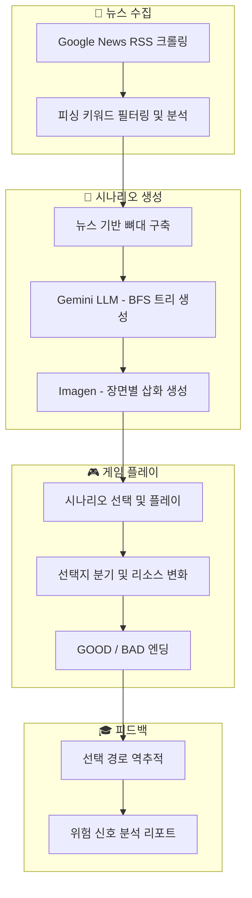

# 🚨 S.O.S (Scam Or Safe)

**텍스트 어드벤처 형식의 피싱·스캠 예방 시뮬레이터**

실제 피싱 사례를 기반으로 한 분기형 시나리오를 통해 피싱 수법을 직접 체험하고, AI 피드백으로 대응 방법을 학습합니다.

> **[📑 발표 자료](assets/SOS.pdf)** | **[🎬 발표 영상](https://www.youtube.com/watch?v=aFW1pDu8vOQ)**

---

## ✨ 주요 기능

| 기능 | 설명 | 핵심 기술 |
|------|------|-----------|
| 📰 **뉴스 기반 시나리오 빌더** | 최신 피싱 뉴스를 크롤링하여 시나리오의 뼈대를 자동 구축 | Google News RSS, LLM 분석 |
| 🤖 **AI 시나리오 생성** | BFS 알고리즘 형태로 Gemini LLM을 호출하여 분기형 시나리오 트리를 생성하고, 주요 장면마다 Imagen이 삽화를 생성 | Gemini 3 Flash, Imagen 4.0 |
| 🎓 **교육적 피드백 시스템** | 게임 종료 후 사용자의 선택 경로를 역추적하여 어느 시점에서 속았는지, 어떤 단서를 놓쳤는지 타임라인 형태로 복기 | Gemini LLM 분석 |
| 🎮 **인터랙티브 게임 플레이** | 선택에 따른 스토리 분기, 리소스 시스템(신뢰도·자산·경각심), GOOD/BAD 엔딩, 위험 선택에 대한 실시간 피드백 | Next.js, Zustand |

---

## 🔄 서비스 파이프라인



---

## ⚙️ 기술적 차별점

### 1. 트리 기반 BFS 시나리오 생성
단일 LLM 호출로는 깊은 분기 시나리오를 안정적으로 생성하기 어렵습니다.
이전 노드를 요약하여 다음 단계 입력으로 전달하는 **트리 기반 BFS 생성 방식**으로 전환하여 자유로운 깊이 조절을 가능하게 했습니다.

### 2. 관리자 기반 뉴스 파이프라인
단순 뉴스 자동 수집·요약에 의존하면 정보 누락·왜곡이 발생할 수 있습니다.
관리자가 뉴스를 선택하면 수법·피해액 등 **핵심 정보를 JSON으로 파싱**하여 시나리오 빌더에 직접 주입합니다.

### 3. 캐릭터 연속성 보장
시나리오별 주연 캐릭터 특징을 JSON으로 정의하고 프롬프트에 고정 주입하여 **동일 캐릭터 유지 및 스타일 일관성**을 보장합니다.

---

## 🏗️ 프로젝트 구조

```
scam-or-safe/
├── backend/                     # FastAPI 백엔드
│   ├── app/
│   │   ├── api/
│   │   │   ├── deps.py          # 의존성 주입
│   │   │   └── routes/          # API 엔드포인트
│   │   │       ├── auth.py      # 인증 API
│   │   │       ├── crawler.py   # 뉴스 크롤러 API
│   │   │       ├── images.py    # 이미지 서빙
│   │   │       └── scenario.py  # 시나리오 API
│   │   ├── core/                # 핵심 기능
│   │   │   ├── image_generator.py
│   │   │   └── news_crawler.py
│   │   ├── data/                # 데이터 저장소
│   │   │   ├── images/          # 생성된 이미지
│   │   │   ├── news_cache/      # 뉴스 기사 캐시
│   │   │   └── scenarios/       # 시나리오 JSON
│   │   ├── models/              # Pydantic 모델
│   │   ├── pipeline/            # LLM 시나리오 생성 파이프라인
│   │   │   ├── context_manager.py
│   │   │   ├── end_sequence.py
│   │   │   ├── enrichment.py
│   │   │   ├── node_generator.py
│   │   │   ├── prompts.py
│   │   │   ├── repair.py
│   │   │   ├── tree_builder.py
│   │   │   └── validation.py
│   │   ├── config.py
│   │   └── main.py
│   ├── credentials/             # GCP 서비스 계정 키
│   ├── tests/                   # 테스트
│   ├── Dockerfile
│   └── requirements.txt
│
├── frontend/                    # Next.js 프론트엔드
│   └── src/
│       ├── app/                 # App Router 페이지
│       │   ├── api/game/        # 게임 API 라우트
│       │   ├── game/            # 게임 플레이 페이지
│       │   ├── generate/        # 시나리오 생성 페이지
│       │   ├── layout.tsx
│       │   └── page.tsx         # 메인 페이지
│       ├── components/
│       │   ├── admin/           # 관리자 컴포넌트
│       │   └── game/            # 게임 UI 컴포넌트
│       ├── hooks/               # 커스텀 훅
│       └── lib/                 # 유틸리티
│
├── scripts/                     # 실행 스크립트
│   ├── start-all.sh             # 전체 서비스 시작
│   ├── start-backend.sh         # 백엔드 시작
│   ├── start-frontend.sh        # 프론트엔드 시작
│   ├── stop-all.sh              # 전체 서비스 중지
│   ├── generate-scenario.sh     # 시나리오 생성
│   └── delete-scenarios.sh      # 시나리오 삭제
│
├── assets/                      # 발표 자료
├── docs/                        # 개발 문서
├── docker-compose.yml
├── DEPLOY.md                    # 배포 가이드
└── README.md
```

---

## 🔧 기술 스택

| 분류 | 기술 |
|------|------|
| 프론트엔드 | Next.js 15, React 19, TypeScript, Tailwind CSS 4, Zustand, Motion |
| 백엔드 | FastAPI, Pydantic v2, LiteLLM, SlowAPI |
| LLM | Google Gemini (gemini-3-flash-preview) |
| 이미지 생성 | Google Imagen (imagen-4.0-fast-generate-001) |
| 뉴스 크롤링 | Google News RSS (API 키 불필요) |
| 배포 | Docker, docker-compose |

---

## 🚀 설치 및 실행

### 1. 환경 설정

```bash
# 클론
git clone https://github.com/beaver-zip/scam-or-safe.git
cd scam-or-safe
```

### 2. 백엔드

```bash
cd backend

# 가상환경 생성 및 활성화
python -m venv venv
source venv/bin/activate  # Windows: venv\Scripts\activate

# 의존성 설치
pip install -r requirements.txt

# 환경변수 설정
cp .env.example .env
# .env 파일에 API 키 입력

# 서버 실행
uvicorn app.main:app --reload --port 8080
```

### 3. 프론트엔드

```bash
cd frontend

# 의존성 설치
npm install

# 환경변수 설정
cp .env.example .env.local

# 개발 서버 실행
npm run dev
```

### 4. 스크립트로 실행

```bash
# 전체 서비스 시작
./scripts/start-all.sh

# 전체 서비스 중지
./scripts/stop-all.sh
```

### 5. Docker 실행

```bash
# 전체 스택 실행
docker-compose up --build

# 개별 실행
docker-compose up backend
docker-compose up frontend
```

### 6. 접속

- 프론트엔드: http://localhost:3000
- 백엔드 API: http://localhost:8080
- API 문서: http://localhost:8080/docs

---

## 🔑 API 키 설정

`.env` 파일 설정:

| 키 | 설명 | 필수 |
|----|------|------|
| `GEMINI_API_KEY` | Gemini API 키 ([발급](https://aistudio.google.com/apikey)) | ✅ |
| `GCP_PROJECT_ID` | Google Cloud 프로젝트 ID (Imagen 이미지 생성용) | 선택 |

> Imagen 사용 시 Google Cloud Console에서 Vertex AI API를 활성화하고, 서비스 계정 JSON 키를 `backend/credentials/`에 배치해야 합니다.

---

## 📡 API

### Backend API

| Method | Endpoint | 설명 |
|--------|----------|------|
| GET | `/health` | 헬스체크 |
| POST | `/api/v1/auth/login` | 관리자 로그인 |
| POST | `/api/v1/auth/logout` | 관리자 로그아웃 |
| GET | `/api/v1/auth/verify` | 관리자 세션 검증 |
| GET | `/api/v1/scenarios` | 시나리오 목록 |
| GET | `/api/v1/scenarios/{id}` | 시나리오 상세 |
| POST | `/api/v1/scenarios/generate` | 시나리오 생성 |
| GET | `/api/v1/scenarios/{task_id}/status` | 생성 작업 상태 |
| POST | `/api/v1/crawler/run` | 뉴스 크롤링 |
| GET | `/api/v1/crawler/status/{task_id}` | 크롤링 상태 |
| GET | `/api/v1/crawler/articles` | 분석된 기사 목록 |

### Frontend API (Next.js API Routes)

| Method | Endpoint | 설명 |
|--------|----------|------|
| POST | `/api/game` | 새 게임 세션 시작 |
| GET | `/api/game/{sessionId}/state` | 게임 상태 조회 |
| POST | `/api/game/{sessionId}/choose` | 선택지 선택 |
| POST | `/api/game/{sessionId}/undo` | 선택 되돌리기 |

---

## 📄 라이선스

본 프로젝트는 [DACON 피싱·스캠 예방을 위한 서비스 개발 경진대회](https://dacon.io/competitions/official/236666/overview/description) 수상작입니다.

[대회 동의사항](https://dacon.io/competitions/official/236666/overview/agreement)에 따라 대회 스폰서에게 비독점적 이용 권한이 부여되어 있습니다. 이 외의 저작권은 저자에게 귀속됩니다.
